# Especificação do projeto

&emsp;O projeto visa resolver a dificuldade de conexão entre doadores de roupas, pessoas em situação de vulnerabilidade e organizações sociais. A solução proposta é uma plataforma digital que facilite esse processo de forma prática, segura e acessível, promovendo a solidariedade e otimizando a comunicação entre os envolvidos.

## Modelo de negócio (*Business Model Canvas*)

&emsp;O *Business Model Canvas* (BMC) é uma ferramenta de planejamento estratégico que descreve, de forma visual e integrada, como uma organização cria, entrega e captura valor.  
No contexto deste projeto, o BMC auxilia no alinhamento da equipe em relação aos aspectos essenciais do negócio, servindo como base para decisões técnicas, de design e de priorização de funcionalidades.  

A seguir está o nosso modelo de negócio ou BMC, feito a partir do [Canva](https://www.canva.com): 

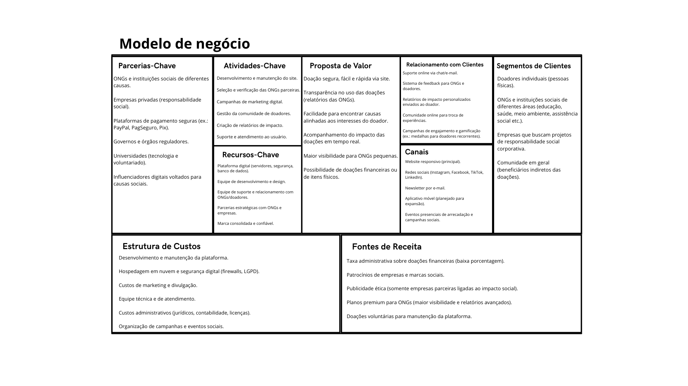

## Personas

👤 Persona 1 – Ana Paula, 32 anos

Ana Paula tem 32 anos, trabalha em período integral e é mãe de uma criança pequena. Mora em uma área urbana e leva uma rotina bastante corrida, dividida entre trabalho e família. Costuma usar o celular para resolver tarefas do dia a dia e prefere aplicativos simples, que mostrem de forma rápida rotas e horários de funcionamento.
Ela deseja encontrar um ponto de coleta próximo e confiável para doar roupas que não utiliza mais, mas já se frustrou em tentativas anteriores, pois os locais eram distantes ou funcionavam em horários que não se encaixavam na sua rotina.

👤 Persona 2 – Carlos Eduardo, 45 anos

Carlos Eduardo tem 45 anos e é líder de uma associação comunitária em seu bairro. Está sempre engajado em ações sociais e costuma organizar campanhas de arrecadação de roupas e alimentos. Usa a tecnologia de forma prática e valoriza ferramentas que ajudem na comunicação com a comunidade.
Seu principal objetivo é cadastrar o ponto de coleta da associação em um sistema que possa atrair mais doadores e dar visibilidade ao trabalho do grupo. Sua maior dificuldade é divulgar os pontos de coleta de maneira eficiente, o que muitas vezes limita a participação de mais pessoas nas campanhas.

👤 Persona 3 – Rafael, 45 anos

Rafael tem 45 anos e trabalhou durante muitos anos como auxiliar de serviços gerais, mas está desempregado há 2 anos. Mora com a esposa e dois filhos pequenos, e sua família enfrenta dificuldades para comprar roupas novas. Já buscou doações em ONGs, porém encontrou processos confusos, demorados e sem retorno.
Hoje, procura uma plataforma confiável, prática e que ofereça uma experiência mais digna para quem precisa receber roupas, permitindo que ele consiga o essencial para sua família de forma rápida e organizada.

👤 Persona 4 – Juliana, 27 anos

Juliana tem 27 anos, é mãe solo de uma menina de 4 anos e trabalha como atendente em um supermercado com salário baixo. Vive em uma comunidade periférica e, apesar de se esforçar para manter as contas em dia, muitas vezes não sobra dinheiro para comprar roupas novas para a filha ou para si mesma.
Ela já recebeu doações em igrejas locais, mas nem sempre encontrou peças no tamanho ou em bom estado. Juliana busca uma plataforma que facilite o acesso a roupas adequadas para sua filha, de forma organizada, sem constrangimentos e sem depender de longas filas ou burocracias.

👤 Persona 5 – Marcos Vinícius, 38 anos

Marcos Vinícius tem 38 anos e é coordenador de uma ONG local que atua em ações sociais voltadas para famílias em situação de vulnerabilidade. Ele está sempre buscando maneiras de ampliar o impacto das campanhas de doação e facilitar o acesso da comunidade aos pontos de coleta.
Com uma rotina corrida entre reuniões, voluntariado e a gestão de projetos, Marcos utiliza a tecnologia como aliada para otimizar seu tempo. Seu principal objetivo é cadastrar os pontos de coleta da ONG em uma plataforma confiável, garantindo maior visibilidade e atraindo mais doadores.
Sua frustração está na dificuldade de manter uma comunicação eficaz com a população e de tornar os pontos de coleta conhecidos por quem realmente deseja ajudar.

## Histórias de usuários

&emsp;Com base na análise das personas, foram identificadas as seguintes histórias de usuários:

|EU COMO... `PERSONA`| QUERO/PRECISO ... `FUNCIONALIDADE` |PARA ... `MOTIVO/VALOR`                 |
|--------------------|------------------------------------|----------------------------------------|
|Doador  | Encontrar uma melhor maneira de fazer doações | Para facilitar e ajudar a vida de pessoas carentes |
|Doador  | Localizar pontos de coleta próximos com horários flexíveis | Para conseguir doar roupas mesmo com minha rotina corrida |
|Receptor | Receber roupas de forma prática em uma plataforma simples | Para garantir que minha família tenha acesso ao essencial com dignidade e sem burocracia |
|Receptor | Buscar roupas adequadas para minha filha em um sistema organizado | Para evitar constrangimentos e garantir peças no tamanho certo, sem depender de filas longas |
|Coordenador de ONG  | Cadastrar o ponto de coleta da associação no sistema | Para atrair mais doadores e dar maior visibilidade às campanhas comunitárias |

## Requisitos

&emsp;As tabelas a seguir apresentam os requisitos funcionais e não funcionais que detalham o escopo do projeto. Para determinar a prioridade dos requisitos, aplique uma técnica de priorização e detalhe como essa técnica foi aplicada.

### Requisitos funcionais

| ID    | Descrição do Requisito                                                                 | Prioridade |
|-------|----------------------------------------------------------------------------------------|------------|
| RF01 | O sistema deve permitir que o usuário se cadastre informando nome, e-mail, senha e tipo de perfil (doador ou receptor). |    ALTA     |
| RF02 | O sistema deve permitir que o doador cadastre roupas, inserindo informações como tipo, tamanho, estado de conservação e foto. |    ALTA     |
| RF03 | O sistema deve permitir que o receptor pesquise roupas disponíveis utilizando filtros (tipo, tamanho, estado). |   MODERADO     |
| RF04 | O sistema deve permitir que o doador edite ou exclua roupas já cadastradas.            |    MODERADO    |
| RF05 | O sistema deve permitir o cadastro de ponto de coletas.                                |    ALTA    |
| RF06 | O sistema deve permitir que o doador aceite ou recuse solicitações de doação.          |    BAIXA    |
| RF07 | O sistema deve disponibilizar o histórico de doações realizadas por cada usuário.      |    BAIXA    |
| RF08 | O sistema deve permitir que o receptor acompanhe o status de sua solicitação (pendente, aceita, recusada). |    MODERADO     |
| RF09 | O sistema deve permitir que os usuários recuperem a senha em caso de esquecimento.     |    BAIXA    |
| RF10 | O sistema deve permitir também a possibilidade de editar os pontos de coleta.          |    MODERADO    |

### Requisitos não funcionais

| ID     | Descrição do Requisito                                                                                       |
|--------|--------------------------------------------------------------------------------------------------------------|
| RNF01 | O sistema deve ser responsivo, funcionando em computadores, tablets e celulares.                              |
| RNF02 | O sistema deve criptografar as senhas dos usuários para garantir a segurança das informações.                  |
| RNF03 | O sistema deve apresentar tempo de resposta inferior a 2 segundos em condições normais de uso.                 |
| RNF04 | O sistema deve armazenar dados em um banco de dados seguro com backups diários automáticos.                    |
| RNF05 | O sistema deve estar disponível no mínimo 95% do tempo, garantindo alta disponibilidade.                       |
| RNF06 | O sistema deve seguir boas práticas de acessibilidade, permitindo uso por pessoas com deficiência visual e auditiva. |
| RNF07 | O sistema deve ter interface intuitiva, com menus e botões de fácil compreensão.                               |
| RNF08 | O sistema deve ser escalável, suportando o crescimento no número de usuários sem perda significativa de desempenho. |
| RNF09 | O sistema deve estar em conformidade com a LGPD (Lei Geral de Proteção de Dados), garantindo privacidade.       |
| RNF10 | O sistema deve permitir atualizações sem comprometer a disponibilidade dos serviços.                           |

## Restrições

&emsp;O projeto está restrito aos itens apresentados na tabela a seguir.

| ID  | Restrição                                                                                                       |
|-----|-----------------------------------------------------------------------------------------------------------------|
| 001 | O sistema só poderá ser acessado por usuários cadastrados e autenticados.                                       |
| 002 | Cada usuário poderá cadastrar apenas roupas em bom estado de uso, proibindo itens danificados ou inadequados.   |
| 003 | O aplicativo dependerá de conexão com a internet para funcionar.                                                |
| 004 | Informações pessoais de doadores e receptores só poderão ser exibidas após a confirmação da doação.             |
| 005 | O sistema não será responsável pela entrega física das roupas, ficando esta etapa sob responsabilidade de doador e receptor. |

## Diagrama de casos de uso

RF-01 -> O sistema deve permitir que o usuário se cadastre informando nome, e-mail, senha e tipo de perfil (doador ou receptor).  
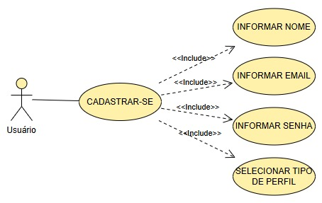

RF-02 -> O sistema deve permitir que o doador cadastre roupas, inserindo informações como tipo, tamanho, estado de conservação e foto.  
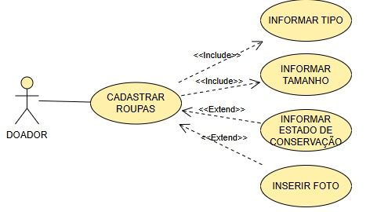

RF-03 -> O sistema deve permitir que o receptor pesquise roupas disponíveis utilizando filtros (tipo, tamanho, estado).  
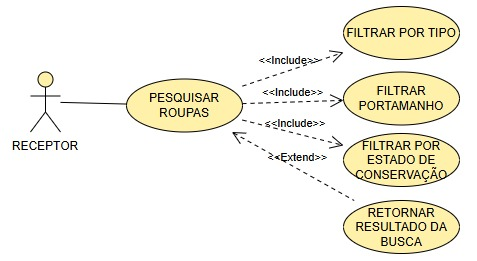

RF-04 -> O sistema deve permitir que o doador edite ou exclua roupas já cadastradas.  
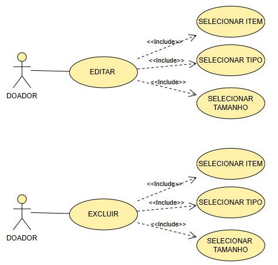

RF-05 -> O sistema deve permitir o cadastro de ponto de coletas.  
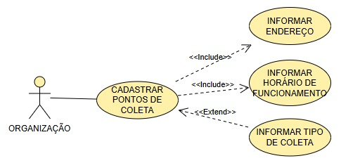

RF-06 -> O sistema deve permitir que o doador aceite ou recuse solicitações de doação.  
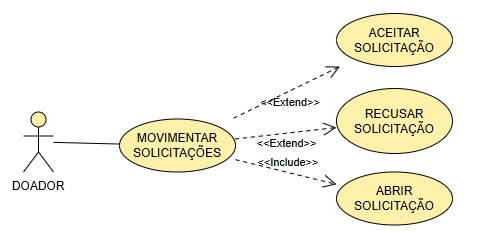

RF-07 -> O sistema deve disponibilizar o histórico de ações realizadas por cada usuário.  
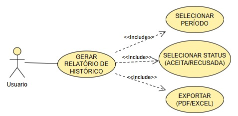

RF-08 -> O sistema deve permitir que o receptor acompanhe o status de sua solicitação (pendente, aceitação, recusada).  
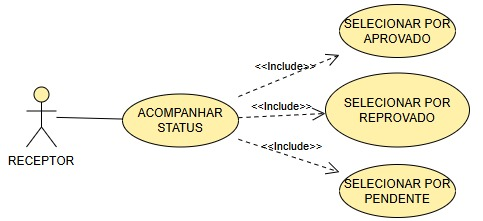

RF-09 -> O sistema deve permitir que os usuários recuperem a senha em caso de esquecimento.  
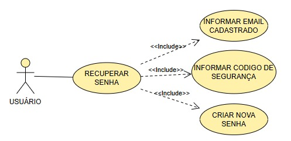

RF-10 -> O sistema deve permitir também a possibilidade de editar os pontos de coleta.  
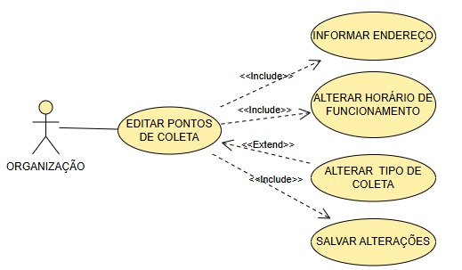
