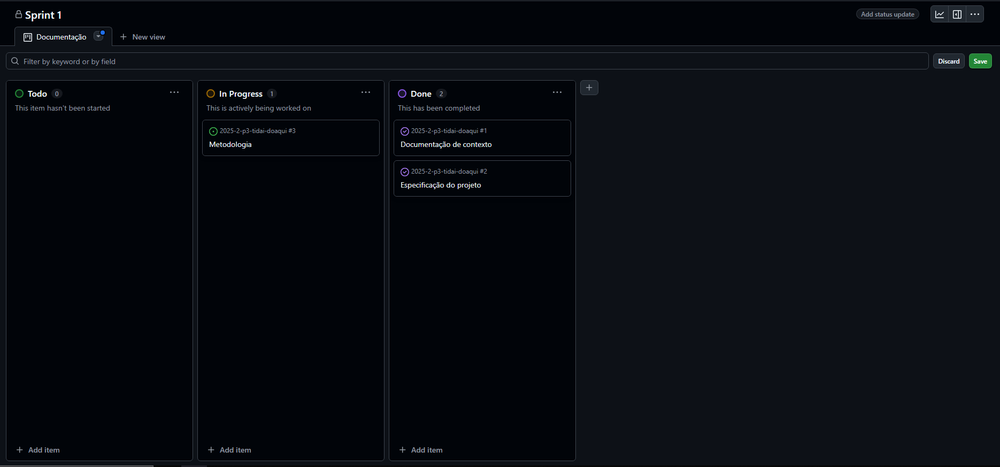

# Metodologia

&emsp;A equipe está organizando o desenvolvimento do projeto utilizando uma metodologia baseada em sprints, inspirada nos princípios do ágil. Cada sprint possui duração definida e engloba um conjunto de tarefas previamente planejadas, possibilitando acompanhar a evolução do trabalho de forma iterativa e incremental. Dessa forma, o grupo consegue identificar eventuais obstáculos rapidamente e garantir entregas contínuas.

&emsp;Para o controle de versionamento do código-fonte, está sendo utilizado o GitHub, que funciona também como repositório central do projeto. Através dessa plataforma, a equipe realiza commits frequentes, criação de branches para novas funcionalidades e merge requests para integração das contribuições, garantindo a rastreabilidade e a organização das alterações.

&emsp;Em relação aos ambientes de trabalho, cada integrante desenvolve em sua própria máquina local, utilizando as ferramentas necessárias para programação e testes. O GitHub atua como ponto de integração e sincronização, permitindo que todos mantenham o mesmo estado do código.

&emsp;Já a gestão da equipe e do fluxo de trabalho é organizada por meio da divisão clara de responsabilidades dentro dos sprints, bem como pela utilização de quadros de tarefas (como boards do GitHub Projects). Esses recursos facilitam a visualização do progresso, a priorização das atividades e a comunicação entre os membros, garantindo que todos estejam alinhados quanto aos prazos e objetivos.

## Controle de versão

A ferramenta de controle de versão adotada no projeto foi o [Git](https://git-scm.com/), sendo que o [GitHub](https://github.com) foi utilizado para hospedagem do repositório.

O projeto segue a seguinte convenção para o nome de branches:

- `main`: versão estável já testada do software
- `unstable`: versão já testada do software, porém instável
- `testing`: versão em testes do software
- `dev`: versão de desenvolvimento do software

Quanto à gerência de issues, o projeto adota a seguinte convenção para etiquetas:

- `documentation`: melhorias ou acréscimos à documentação
- `bug`: uma funcionalidade encontra-se com problemas
- `enhancement`: uma funcionalidade precisa ser melhorada
- `feature`: uma nova funcionalidade precisa ser introduzida

Discuta como a configuração do projeto foi feita na ferramenta de versionamento escolhida. Exponha como a gestão de tags, merges, commits e branches é realizada. Discuta também como a gestão de issues foi feita.

> **Links úteis**:
> - [Tutorial GitHub](https://guides.github.com/activities/hello-world/)
> - [Git e GitHub](https://www.youtube.com/playlist?list=PLHz_AreHm4dm7ZULPAmadvNhH6vk9oNZA)
> - [Comparando fluxos de trabalho](https://www.atlassian.com/br/git/tutorials/comparing-workflows)
> - [Understanding the GitHub flow](https://guides.github.com/introduction/flow/)
> - [The gitflow workflow - in less than 5 mins](https://www.youtube.com/watch?v=1SXpE08hvGs)

## Planejamento do projeto

###  Divisão de papéis

> Apresente a divisão de papéis entre os membros do grupo em cada Sprint. O desejável é que, em cada Sprint, o aluno assuma papéis diferentes na equipe. Siga o modelo do exemplo abaixo:

#### Sprint 1
##### Contexto 
- Responsável pela introdução e problema: Arthur Alves
- Responsável pelos objetivos e justificativa: Raphael
- Responsável pelo publico alvo: Arthur Souza
##### Especificação do projeto
- Modelo de negócio realizado por: Arthur Souza, Raphael
- Personas e histórias de usuário: Arthur Alves, Arthur Souza
- Requisitos Funcionas e não funcionais: Arthur Alves, Adenilson
- Diagramas de caso de uso: Adenilson
##### Metodologia
- Controle de versão: Lucas
- Divisão de papeis e quadro de tarefas: Arthur Souza
- Processo e utilização do GitHubProjects: Arthur Souza
- Ferramentas: Lucas
  

#### Sprint 2
##### Projeto de interface
- Telas e Wireframes: Arthur Alves
- UserFlow: Raphael
- Jornada do usuário: Adenilson
###### Template padrão da aplicação
- Toda descrição sobre paleta de cores, logotipo, layout: Arthur Souza, Lucas
###### Arquitetura da solução
- Estrutura do sitema: Arthur Souza
- Diagrama de classes: Arthur Souza
- Modelo conceitual, relacional e físico: Arthur Souza
- Tecnologias e hospedagem: Raphael
- Qualidades de software: Raphael

#### Sprint 3
- A definir

#### Sprint 4
- A definir
  
###  Quadro de tarefas

> Apresente a divisão de tarefas entre os membros do grupo e o acompanhamento da execução, conforme o exemplo abaixo.

#### Sprint 1

Atualizado em: 23/09/2025

| Responsável   | Tarefa/Requisito | Iniciado em    | Prazo      | Status | Terminado em    |
| :----         |    :----         |      :----:    | :----:     | :----: | :----:          |
| Arthur A, Arthur S, Raphael | Contexto | 22/08/2025     | 02/09/2025 | ✔️    | 23/08/2025 |
| Adenilson, Arthur A, Arthur S, Raphael | Especificação do projeto | 22/08/2025     | 02/09/2025 | ✔️    | 26/08/2025 |
| Lucas, Arthur S | Metodologia  | 31/08/2025    | 02/09/2025 | ⌛     | ---------- |

#### Sprint 2

Atualizado em: 23/09/2025

| Responsável   | Tarefa/Requisito | Iniciado em    | Prazo      | Status | Terminado em    |
| :----         |    :----         |      :----:    | :----:     | :----: | :----:          |
| Adenilson, Arthur A, Arthur S, Raphael | Projeto de interface   | 15/09/2025    | 23/09/2025 | ✔️  | 23/09/2025    |
| Arthur A, Lucas | Template padrão de aplicação   | 18/09/2025    | 23/09/2025 | ✔️   |  23/09/2025 |
| Arthur A, Raphael | Arquitetura de solução  | 18/09/2025    | 23/09/2025 | ✔️  | 23/09/2025 |

#### Sprint 3
- A definir

#### Sprint 4
- A definir

Legenda:
- ✔️: terminado
- 📝: em execução
- ⌛: atrasado
- ❌: não iniciado

### Processo

&emsp;A equipe adotou o Scrum como metodologia de organização, estruturando o desenvolvimento em sprints com metas definidas para cada ciclo. Para apoiar esse processo, foi utilizado o recurso de gerenciamento de projetos do GitHub (GitHub Projects), que possibilita acompanhar o andamento das atividades e o status do desenvolvimento da solução em tempo real.

&emsp;O quadro de tarefas foi dividido em colunas representando os diferentes estágios do fluxo de trabalho: “To Do” (tarefas a serem iniciadas), “In Progress” (tarefas em andamento) e “Done” (tarefas concluídas). Dessa forma, o grupo consegue visualizar de maneira clara o progresso de cada sprint, identificar responsabilidades e monitorar a evolução do projeto.

A figura abaixo apresenta um exemplo da estrutura utilizada pela equipe para gerenciar a primeira sprint do projeto:
 

## Ferramentas

&emsp;Para a conclusão deste projeto, foram utilizadas diferentes plataformas e ferramentas, cada uma desempenhando um papel específico no processo de desenvolvimento. A seguir, são apresentados os artefatos produzidos e a relação entre os ambientes adotados e seus respectivos propósitos, organizados na tabela abaixo.

| Ambiente                            | Plataforma                         | Link de acesso                         |
|-------------------------------------|------------------------------------|----------------------------------------|
| Repositório de código fonte         | GitHub                             | [Repositório](https://github.com/ICEI-PUC-Minas-PBE-ADS-SI/2025-2-p3-tidai-doaqui) |
| Documentos do projeto               | GitHub                             | [Documentação](https://github.com/ICEI-PUC-Minas-PBE-ADS-SI/2025-2-p3-tidai-doaqui/tree/main/docs) |
| Projeto de interface                | Figma                              | [Figma](https://www.figma.com/design/zkdzPRsLwolYwcqC5l9z2M/telas-TI?node-id=0-1&t=fgCNNEVdk6Go7BL1-1)   |
| Gerenciamento do projeto            | GitHub Projects                    | [Projetos](https://github.com/ICEI-PUC-Minas-PBE-ADS-SI/2025-2-p3-tidai-doaqui/projects?query=is%3Aopen) |
| Hospedagem                          | Vercel                             | http://....                            |
| Criação de Desing                   | Canva                              | Sem link de acesso| 
| Comunicação                         | Discord                            | Sem link de acesso | 
 
