# Projeto de interface

Visão geral da interação do usuário pelas telas do sistema e protótipo interativo das telas com as funcionalidades que fazem parte do sistema (wireframes).

 ## User flow

Fluxo de usuário (user flow) é uma técnica que permite ao desenvolvedor mapear todo o fluxo de navegação do usuário na aplicação. Essa técnica serve para alinhar os caminhos e as possíveis ações que o usuário pode realizar junto com os membros da equipe.

Abaixo está o fluxo de usúario como Doador:
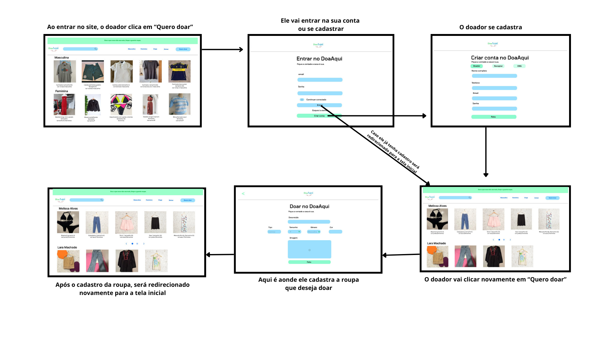

Abaixo está o fluxo de usúario como Receptor:
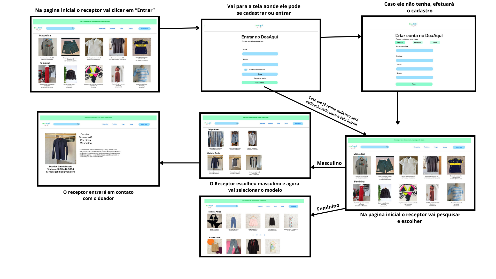

Abaixo está o fluxo de usúario como ONG:
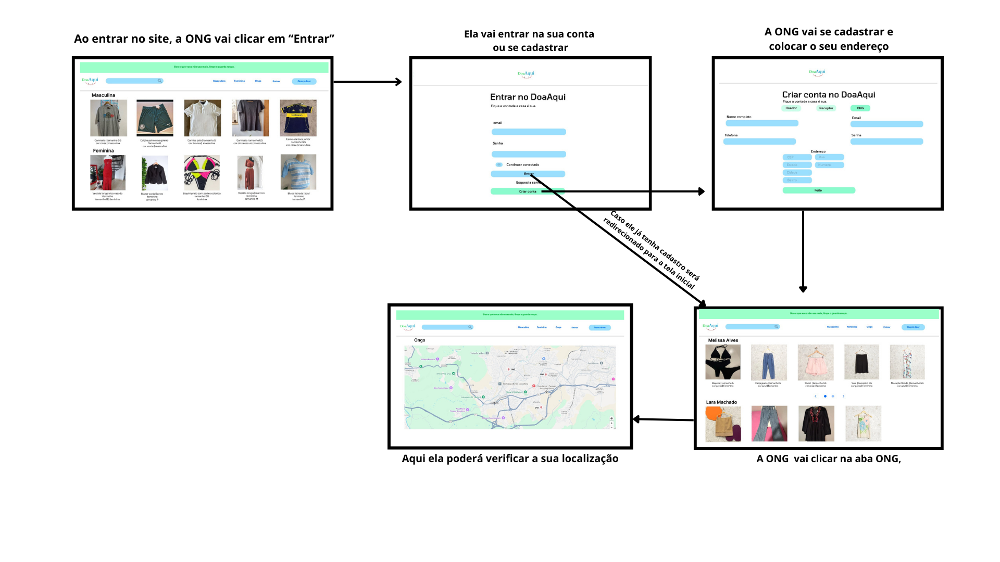

## Wireframes

O wireframe define a estrutura inicial do site, destacando o cabeçalho com logotipo e menu de navegação, a área principal de conteúdo com destaque para seções específicas e a barra lateral com links adicionais.

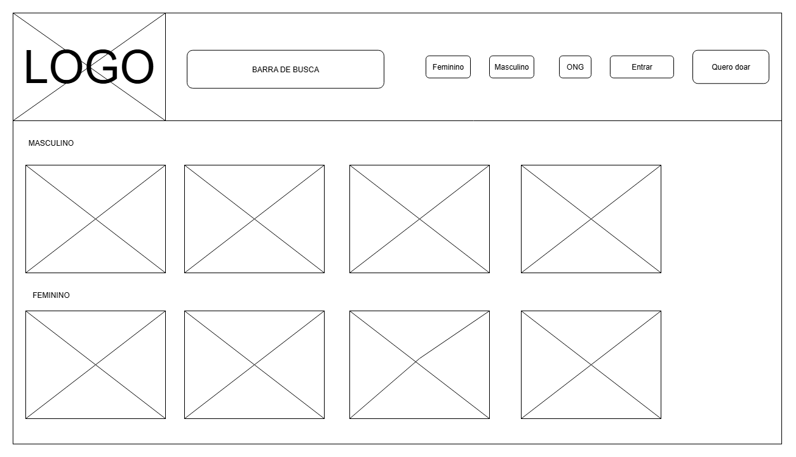
 

## Protótipo interativo

Aqui está o protótipo interativo realizado pelo Figma onde é capaz de visualizar todo o trajeto pelo projeto da interface:

> [https://www.figma.com/proto/zkdzPRsLwolYwcqC5l9z2M/telas-TI?node-id=1-2&p=f&t=nFLWClcMdqmBxTfR-1&scaling=contain&content-scaling=fixed&page-id=0%3A1](https://www.figma.com/proto/zkdzPRsLwolYwcqC5l9z2M/telas-TI?node-id=1-2&p=f&t=nFLWClcMdqmBxTfR-1&scaling=contain&content-scaling=fixed&page-id=0%3A1)

## Jornada do usuário

A jornada do usuário descreve, em alto nível de detalhes, as etapas que diferentes perfis de usuários realizam para concluir uma tarefa específica na aplicação. Essa técnica ajuda a identificar pontos fortes e oportunidades de melhoria na experiência.  
A seguir as 3 Jornadas do usuário: Doador , Receptor , ONG

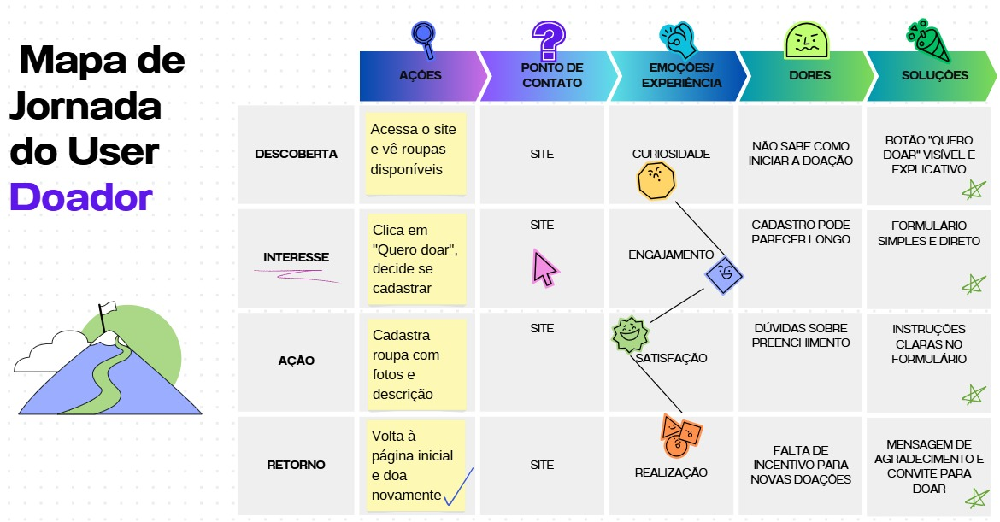
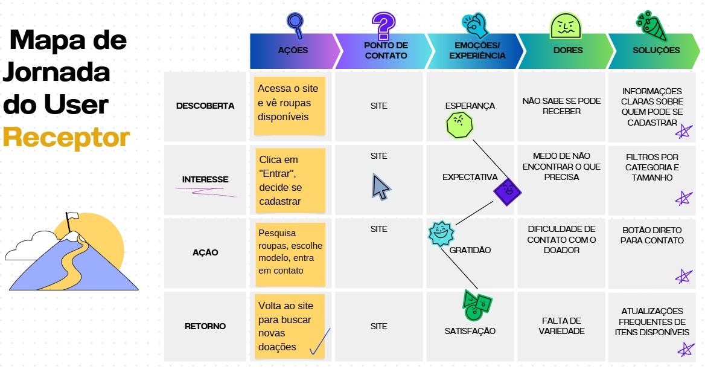
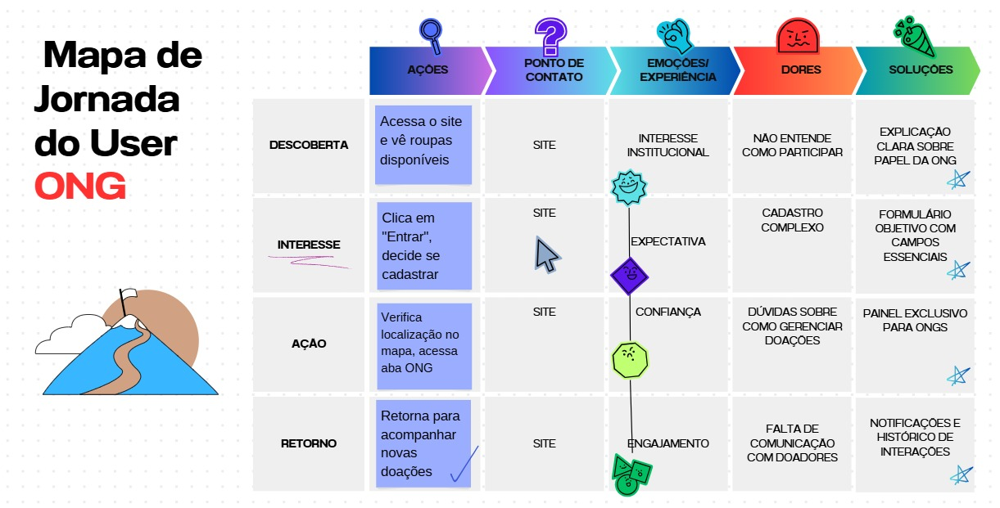

## Interface do sistema

Apresente **todas as interfaces do sistema**, em sua versão final, descrevendo brevemente a função de cada tela.

Tela inicial, o primeiro contato do usuário.
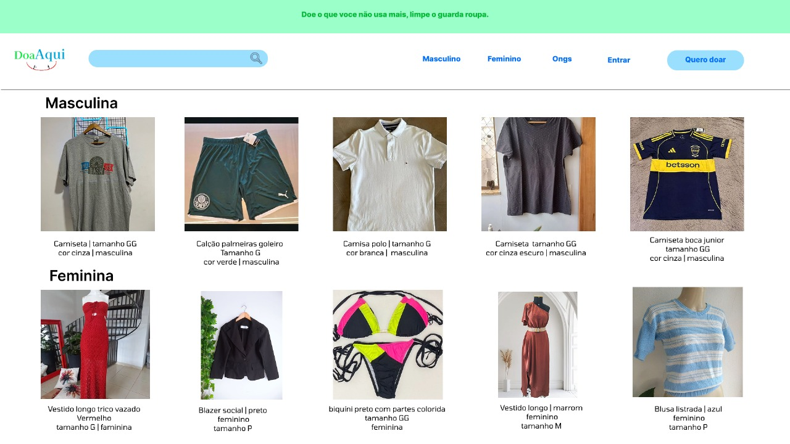

Masculino, mostra seção de roupas masculinas.
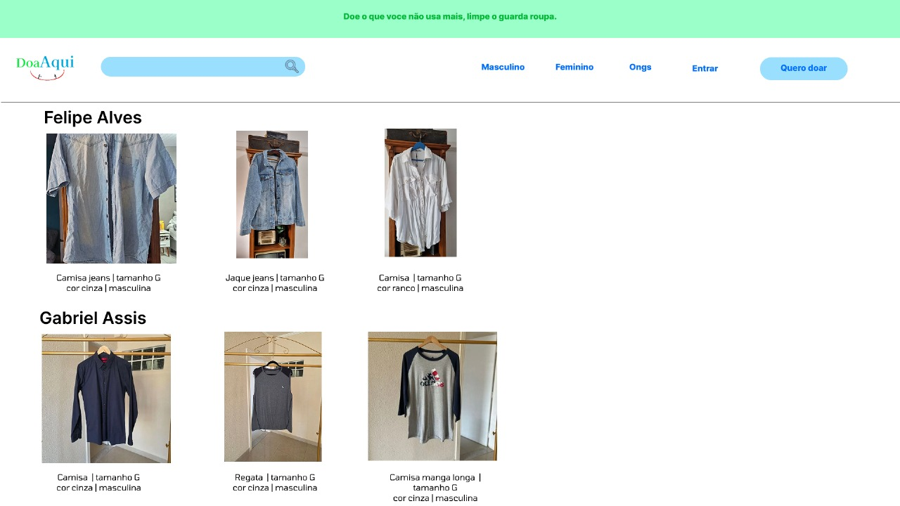

Feminino, mostra seção de roupas femininas.
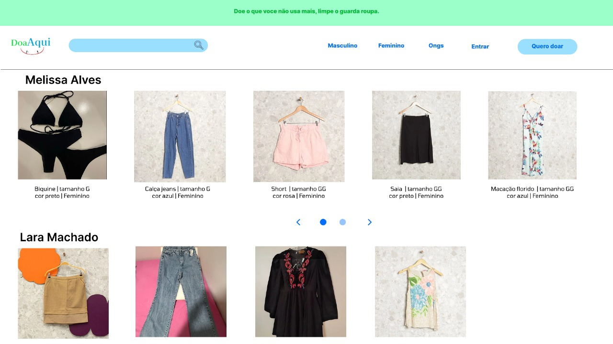

Entrando, o usuario logando com sua conta.
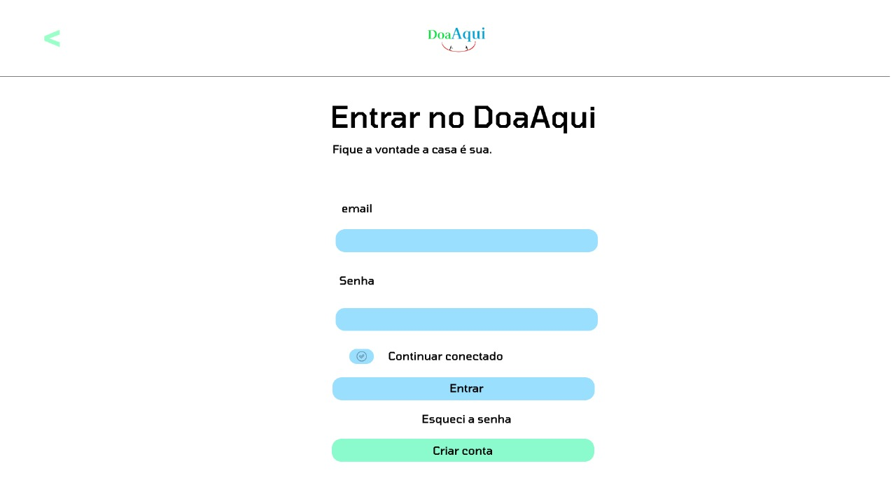

Entrando pela primeira vez, caso o usúario tentar clicar no quero doar sem possuir uma conta.
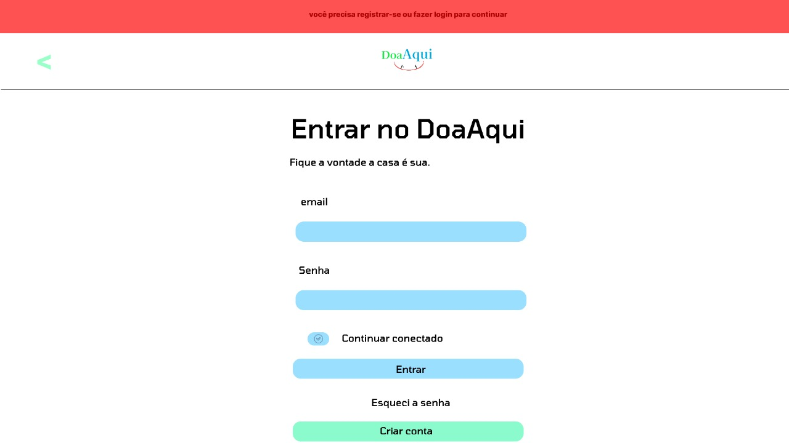

Cadastro da roupa de doação, aqui o usuario insere todas as informações da roupa para doação.
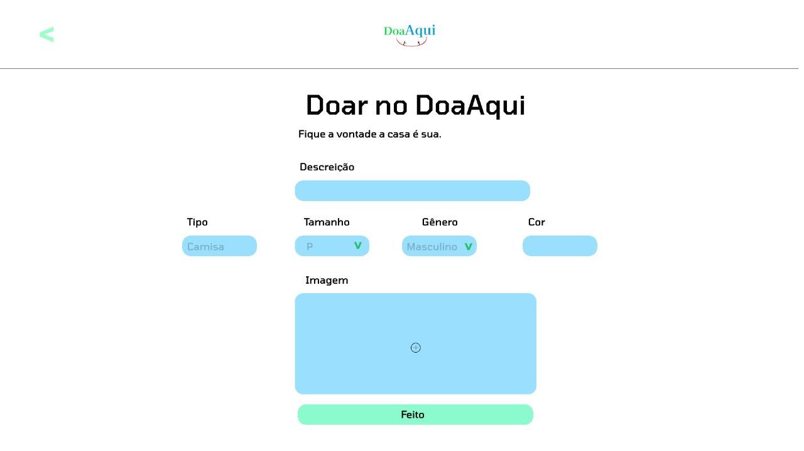

Cadastro, Nessa tela se poderá cadastrar como doador ou receptor
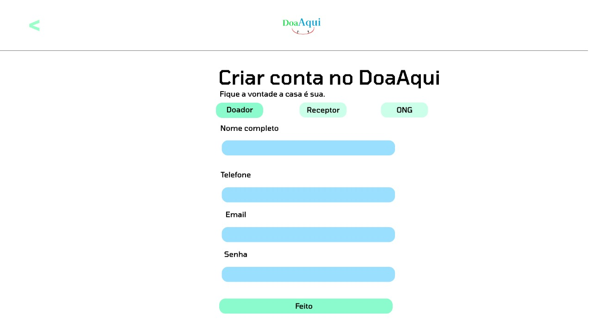

Cadastro, Nessa tela se poderá cadastrar como ong informando também o endereço

Mapa, Nessa tela se podera ver todos os pontos de coleta das ONGS
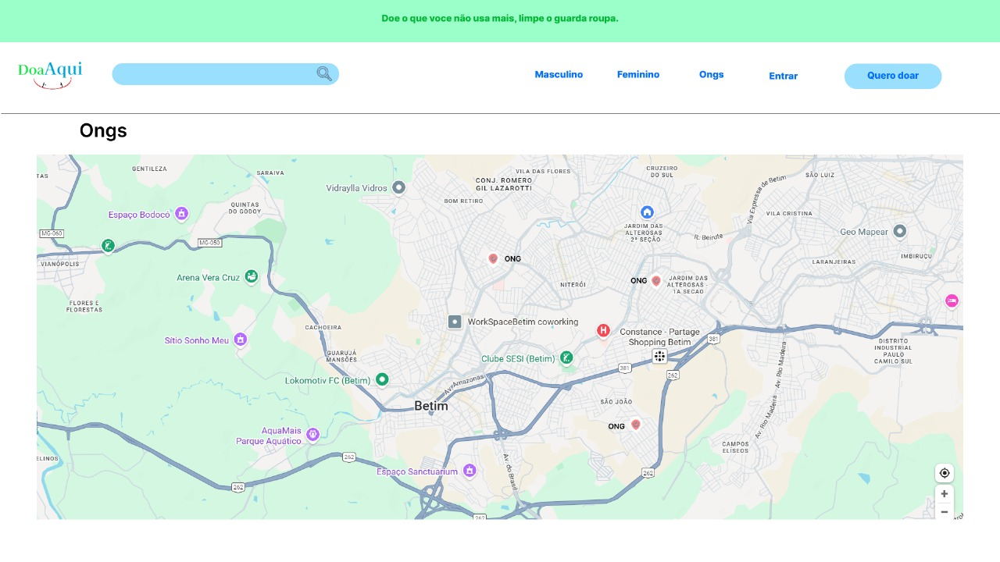

Roupas, Após o usúario clicar em uma das roupas, ele poderá entrar em contato com o doador a partir de suas informações
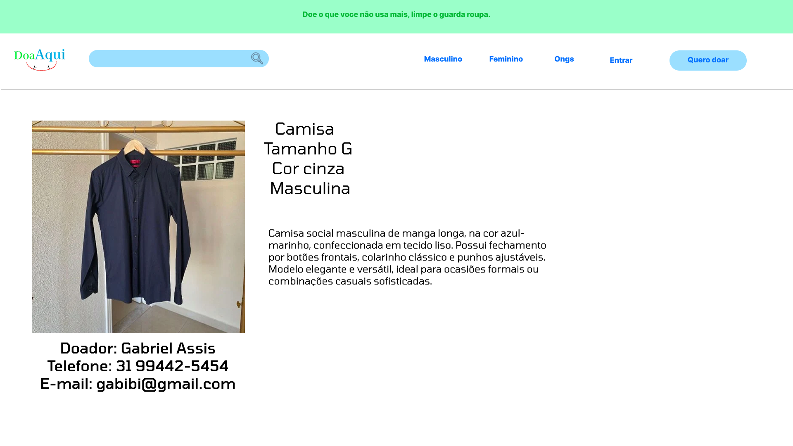

