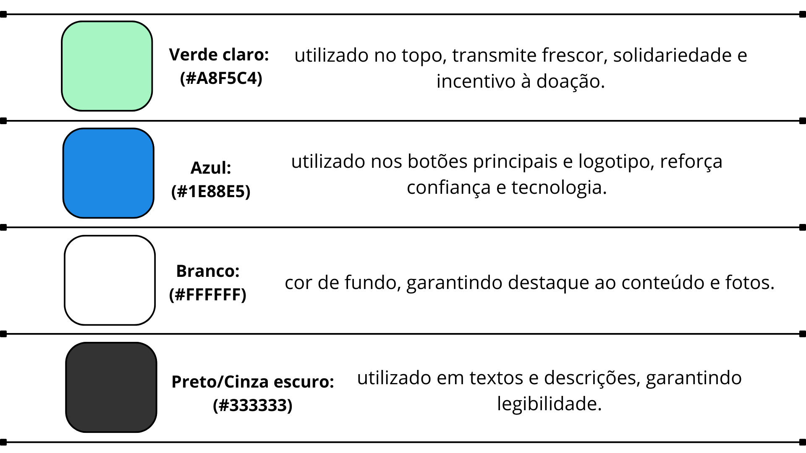

# Template padrão da aplicação

## Identidade Visual  
A aplicação utiliza um design simples e objetivo, priorizando a clareza das informações e a praticidade na navegação.  
A identidade visual é composta por uma paleta de cores leves e contrastes fortes nos botões de ação, mantendo consistência em todas as páginas.  

### 🎨 Paleta de cores 

### ✍️ Tipografia  
- **Botões e categorias:** Inter, Medium/Bold (clareza e legibilidade em áreas de ação).  
- **Descrições das roupas:** Tomorrow, Regular (dando um ar mais estilizado e diferenciado ao conteúdo).

---

## Logotipo  
- Localizado no canto superior esquerdo em todas as páginas.  
- Possui duas cores principais: **verde (Doa)** e **azul (Aqui)**, transmitindo solidariedade e confiança.  
- O arco curvado abaixo sugere um **sorriso**, simbolizando acolhimento e felicidade gerada pelo ato da doação.
- Dentro do arco que forma o sorriso, aparecem duas figuras humanas estilizadas. Essas figuras representam doação e solidariedade, pois uma entrega uma peça de roupa à outra.

**Regras de uso:**  
- Não distorcer ou alterar as cores originais.  
- Utilizar sempre em fundo claro.  
- Manter tamanho mínimo para legibilidade (120px).

---

## Elementos Gráficos  

###  Tela de Exemplo  
A **tela inicial** serve como demonstração do template: 

- **Botões de navegação:** texto azul, sem bordas, simples e diretos.  
- **Botão de destaque ("Quero doar"):** azul com fundo sólido, bordas arredondadas, cor branca no texto.  
- **Barra de busca:** localizada no header, centralizada, com ícone de lupa.  
- **Cards de roupas:** imagem grande, descrição em texto logo abaixo, padronizada com “nome | tamanho | cor | gênero”.  

---

## Estrutura do Layout Padrão  
- **Header (fixo em todas as páginas):**  
  - Logo no canto esquerdo.  
  - Barra de busca ao centro.  
  - Botões de navegação à direita.  

- **Corpo (conteúdo da página):**  
  - Exibe categorias (Masculina, Feminina, etc.).  
  - Grade de imagens em colunas (cada item com foto + descrição).  
  - Conteúdo centralizado e espaçado, facilitando leitura e navegação.  

- **Footer:**  
  - Não utilizado, mantendo o design simples e direto.  

---

## Responsividade  
- **Desktop:** menu em linha (logo + busca + botões).  
- **Tablet:** busca reduzida, itens reorganizados em 2 colunas.  
- **Celular:** menu em ícone hambúrguer (☰), busca ocupa largura total, imagens em 1 coluna.  

---

## Significado Visual  
A proposta visual conecta-se diretamente com os valores da aplicação:  
- **Simplicidade:** navegação direta, sem excessos visuais.  
- **Solidariedade:** cores claras e amigáveis transmitem acolhimento.  
- **Confiança:** uso do azul garante credibilidade.  
- **Comunidade:** logo em formato de sorriso representa alegria e união no ato de doar.  

