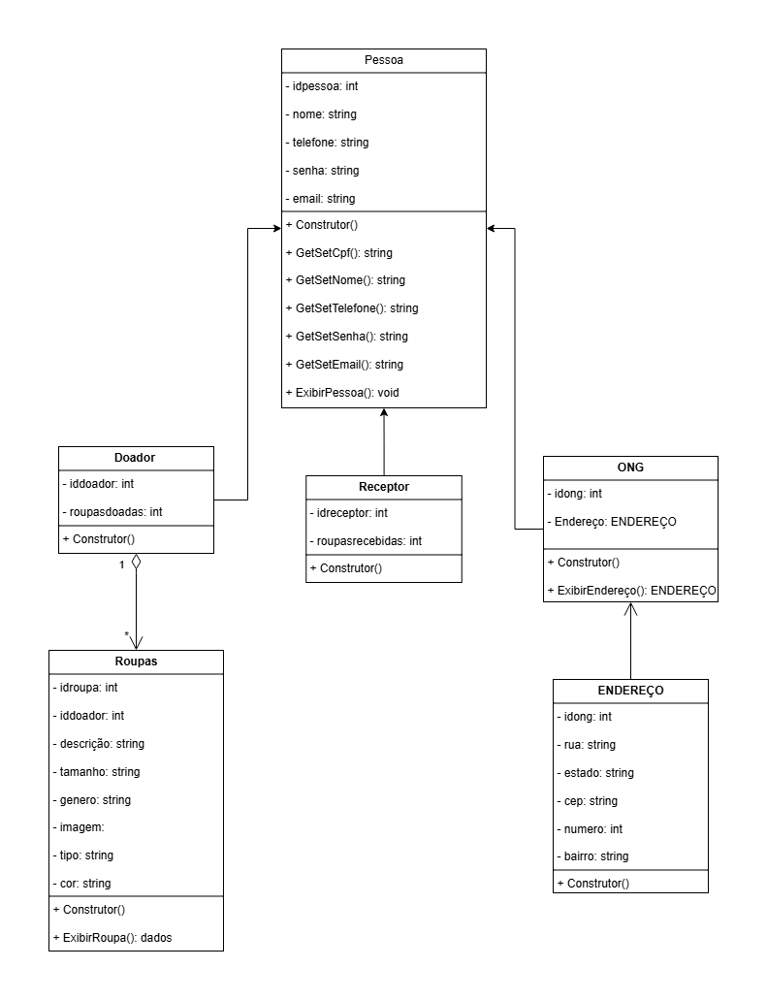
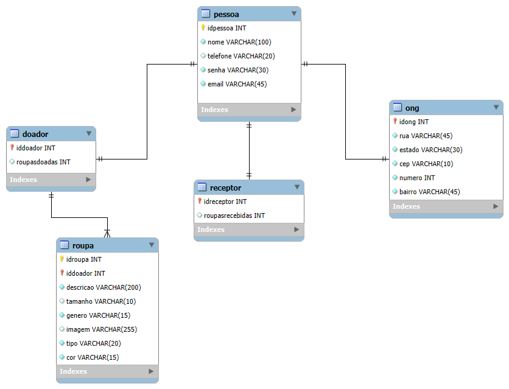

# Arquitetura da solução

O software é estruturado em três componentes principais: Front-end, Back-end e Banco de Dados, que trabalham de forma integrada para oferecer a solução completa.

>  O Front-end é responsável pela interface com o usuário, permitindo interação e visualização das informações.

>  O Back-end gerencia a lógica da aplicação, processa requisições, aplica regras de negócio e se comunica com o banco de dados.

>  O Banco de Dados armazena de forma persistente os dados da aplicação, garantindo segurança e integridade das informações. 

A imagem abaixo apresenta a visão estrutural do sistema, mostrando como esses componentes estão organizados, se comunicam entre si e onde estão hospedados.


## Diagrama de classes

O diagrama de classes abaixo ilustra graficamente a estrutura do software e como cada uma das classes estará interligada. Essas classes servem de modelo para materializar os objetos que serão executados na memória.



##  Modelo de dados

O desenvolvimento da solução requer bases de dados confiáveis, que possibilitem o cadastro, controle e recuperação dos dados necessários para os processos da aplicação, garantindo integridade e consistência das informações e permitindo a integração eficiente entre o front-end e o back-end.

### Modelo conceitual 

A seguir, apresenta-se o Diagrama Entidade-Relacionamento (DER), elaborado na notação Peter Chen, que ilustra de forma clara como as entidades do sistema se conectam entre si. O modelo inclui atributos, relacionamentos e cardinalidades, garantindo uma base de dados integrada capaz de suportar todos os processos mapeados.


### Modelo relacional

O Modelo Relacional organiza os dados em tabelas (relações), compostas por linhas (tuplas) e colunas (atributos), incluindo chaves primárias, chaves estrangeiras e demais restrições de integridade. A figura a seguir apresenta o modelo “pé de galinha” elaborado no MySQL Workbench, que reflete a estrutura relacional do sistema e suas conexões entre as entidades.



### Modelo físico

A seguir, apresenta-se o script SQL responsável pela criação das tabelas do banco de dados, incluindo definições de atributos, chaves primárias, chaves estrangeiras e demais restrições de integridade, conforme o modelo relacional definido anteriormente.

```sql
CREATE TABLE Pessoa (
    idpessoa INT PRIMARY KEY,
    nome VARCHAR(50) NOT NULL,
    telefone VARCHAR(20),
    senha VARCHAR(30) NOT NULL,
    email VARCHAR(100) UNIQUE
);

CREATE TABLE Doador (
    iddoador INT PRIMARY KEY,
    roupasdoadas INT DEFAULT 0,
    FOREIGN KEY (iddoador) REFERENCES Pessoa(idpessoa)
    ON DELETE CASCADE
    ON UPDATE CASCADE
);

CREATE TABLE Receptor (
    idreceptor INT PRIMARY KEY,
    roupasrecebidas INT DEFAULT 0,
    FOREIGN KEY (idreceptor) REFERENCES Pessoa(idpessoa)
    ON DELETE CASCADE
    ON UPDATE CASCADE
);

CREATE TABLE ONG (
    idong INT PRIMARY KEY,
    rua VARCHAR(100) NOT NULL,
    estado VARCHAR(50) NOT NULL,
    cep VARCHAR(10) NOT NULL,
    numero INT NOT NULL,
    bairro VARCHAR(50) NOT NULL,
    FOREIGN KEY (idong) REFERENCES Pessoa(idpessoa)
    ON DELETE CASCADE
    ON UPDATE CASCADE
);

CREATE TABLE Roupas (
    idroupa INT AUTO_INCREMENT PRIMARY KEY,
    iddoador INT NOT NULL,
    descricao VARCHAR(200) NOT NULL,
    tamanho VARCHAR(10),
    genero VARCHAR(20) NOT NULL,
    imagem VARCHAR(255) NOT NULL,
    tipo VARCHAR(20) NOT NULL,
    cor VARCHAR(15) NOT NULL,
    FOREIGN KEY (iddoador) REFERENCES Doador(iddoador)
    ON DELETE CASCADE
    ON UPDATE CASCADE
);
```


## Tecnologias

Descreva as tecnologias utilizadas para implementar a solução proposta. Liste todas as tecnologias envolvidas, incluindo linguagens de programação, frameworks, bibliotecas, serviços web, IDEs, ferramentas de apoio e quaisquer outros recursos relevantes para o desenvolvimento.  
Apresente também um diagrama ou figura que ilustre a visão operacional, mostrando como as tecnologias interagem entre si durante o uso do sistema, desde a ação do usuário até a obtenção da resposta.


| **Dimensão**   | **Tecnologia**  |
| ---            | ---             |
| Front-end      | HTML + CSS + JS + React |
| Back-end       | C#              |
| SGBD           | MySQL           |
| Deploy         | Vercel          |


## Hospedagem

**Hospedagem e Lançamento da Plataforma**

A hospedagem e o lançamento da plataforma foram realizados com uma estratégia moderna e integrada, utilizando a Vercel como a única plataforma para hospedar todas as camadas da aplicação.

**Estratégia de Hospedagem**

A decisão de centralizar a hospedagem na Vercel foi tomada para garantir agilidade no desenvolvimento e alto desempenho. Em vez de utilizar serviços separados para front-end e back-end, adotamos uma arquitetura unificada.

Front-end: A interface da plataforma, construída com React, é hospedada na Vercel, aproveitando sua rede de entrega de conteúdo (CDN) global, que garante o carregamento rápido das páginas para usuários em qualquer lugar.

Back-end: A lógica de negócio, incluindo o processamento de doações e a interação com o banco de dados, é gerenciada por Serverless Functions (Funções sem Servidor), também hospedadas na Vercel. Esse modelo executa o código do back-end apenas quando uma requisição é necessária, o que otimiza recursos e custos.

**Processo de Lançamento (Deploy)**

O processo de lançamento é totalmente automatizado e vinculado ao nosso repositório no GitHub.

Deploy Contínuo: A Vercel está configurada para monitorar a branch principal do projeto. Sempre que uma alteração é enviada para o código, a Vercel inicia automaticamente o processo de compilação e publicação. Isso garante que as atualizações cheguem ao ar de forma rápida e segura.    

Ambientes de Preview: Para cada nova funcionalidade em desenvolvimento, a Vercel cria um ambiente de visualização com uma URL exclusiva. Isso permite que a equipe ou as partes interessadas testem as novas funcionalidades em um ambiente real antes de serem lançadas para o público.
Essa metodologia de hospedagem simplificou o fluxo de trabalho e garantiu que o foco principal pudesse ser a evolução da plataforma, em vez da gestão da infraestrutura.

## Qualidade de software

Com base nas necessidades específicas do nosso projeto de plataforma de doações, o time de desenvolvimento elegeu um conjunto de subcaracterísticas de qualidade como guias para nortear o processo de criação. A escolha dessas características foi estratégica, visando garantir que o produto final seja seguro, confiável e, acima de tudo, eficiente para os usuários.
A seguir, apresentamos as subcaracterísticas escolhidas, suas justificativas no contexto da nossa plataforma de doações e as métricas que serão utilizadas para sua avaliação.
Características e Métricas de Qualidade

1. Segurança: Confidencialidade
Justificativa: Em um site de doações, a Confidencialidade é a subcaracterística mais crítica. A plataforma lida com informações pessoais sensíveis e dados de pagamento, e qualquer falha na proteção desses dados poderia resultar na perda da confiança dos usuários. Garantir a confidencialidade é essencial para manter a credibilidade e a segurança do serviço.

Métricas de Avaliação:

Número de vulnerabilidades: Contagem de vulnerabilidades de segurança encontradas em testes automatizados (scanners de código) e manuais (testes de penetração).
Uso de HTTPS: Avaliação de que todas as comunicações entre o cliente (navegador) e o servidor utilizam o protocolo HTTPS para criptografia.

2. Confiabilidade: Maturidade
Justificativa: A Maturidade da plataforma se refere à sua estabilidade e à frequência com que o sistema falha. Em uma plataforma de doações, uma falha na hora de processar um pagamento ou um erro no sistema significa uma doação perdida e uma experiência frustrante. O sistema precisa ser robusto e funcionar de forma previsível.

Métricas de Avaliação:

Tempo de Atividade (Uptime): Porcentagem de tempo em que a plataforma está disponível e funcionando corretamente. A meta é ter um uptime de 99,9%.
Taxa de Erros em Transações: Proporção de transações de doação que falham por causa de um erro no sistema. A meta é manter essa taxa o mais próxima de zero possível.

3. Usabilidade: Inteligibilidade
   
Justificativa: A Inteligibilidade refere-se à facilidade com que o usuário compreende a interface e o processo de doação. Um formulário confuso, botões pouco claros ou um fluxo complicado podem fazer com que o usuário desista da doação. É fundamental que a jornada do doador seja simples, direta e intuitiva.

Métricas de Avaliação:

Taxa de Abandono de Carrinho: Porcentagem de usuários que iniciam o processo de doação, mas não o concluem.
Tempo para Concluir a Doação: Medição do tempo médio que um usuário leva para finalizar o processo, do início ao fim.

4. Eficiência de Desempenho: Comportamento em Tempo
Justificativa: O Comportamento em Tempo está diretamente ligado à velocidade de resposta do sistema. Ninguém gosta de esperar. Uma página que demora a carregar ou um botão que demora a responder pode causar impaciência e a perda de um doador.

Métricas de Avaliação:

Tempo de Carregamento da Página: Medição do tempo (em segundos) que a página de doação leva para carregar completamente.
Tempo de Resposta do Servidor: Tempo que o servidor leva para processar uma requisição de doação e enviar a resposta de volta. A meta é um tempo de resposta inferior a 500ms.
